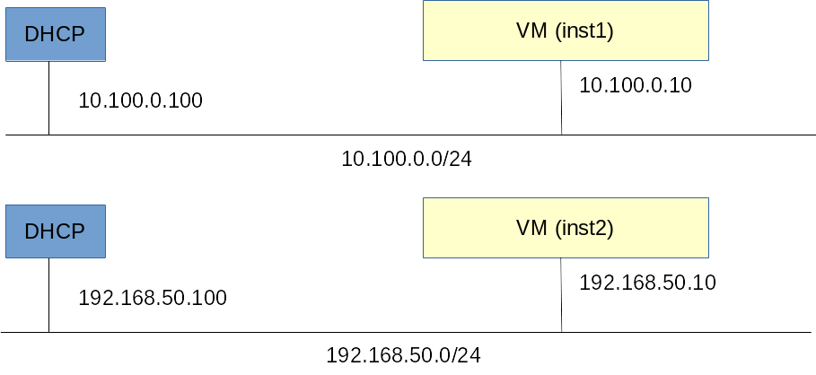

# Two virtual networks

## Overview

This document expects you to have set up OpenVNet according to the [installation guide](installation), created the simple [single network](single-network) and set up [its DHCP server](single-network-dhcp). We will be continuing from there so complete those steps first.

In this guide we will set up a second virtual network and move `inst2` to it. We'll also set up a new DHCP server for that network. That will give us the following topology.



## Setup

The first two steps we have done before. Create a new network and setup its simulated DHCP service.

### Create the new network

```bash
vnctl networks add \
  --uuid nw-test2 \
  --display-name testnet2 \
  --ipv4-network 192.168.50.0 \
  --ipv4-prefix 24 \
  --network-mode virtual
```

### Set up its DHCP server

```bash
vnctl interfaces add \
  --uuid if-dhcp2 \
  --mode simulated \
  --owner-datapath-uuid dp-test1 \
  --mac-address 02:00:00:00:01:12 \
  --network-uuid nw-test2 \
  --ipv4-address 192.168.50.100


vnctl network-services add \
  --uuid ns-dhcp2 \
  --interface-uuid if-dhcp2 \
  --type dhcp
```

### Move inst2 to the new network

Up until now we have used a single vnctl command to create a new interface, put it in a virtual network and assign it an IP address. While this is all pretty simple from the user's perspective, OpenVNet actually some quite complicated setup behind the scenes.

At the time of writing, this single-command interface setup is only supported when creating a new interface and not when editing an existing one. That leaves us two ways of putting `inst2` in our newly created network.

* The quick and dirty way. Remove its interface and re-create it.

* The clean but more complicated way. Dig a little deeper into OpenVNet's inner workings make only the required changes.

Choose one of the two two ways below.

#### The quick and dirty way.

To keep things simple, we will just remove `inst2` from OpenVNet's database and re-create it.

A side effect of this method is that we will not be able to use the same UUID. That's because OpenVNet's database uses logical delete. Deleted records aren't actually removed but only marked as deleted and thus their unique fields cannot be reused.

```bash
vnctl interfaces del if-inst2
```

Now re-create it. Since we can't reuse the UUID `if-inst2`, we'll use `if-newinst2`.

```bash
vnctl interfaces add \
  --uuid if-newinst2 \
  --mode vif \
  --owner-datapath-uuid dp-test1 \
  --mac-address 10:54:ff:00:00:02 \
  --network-uuid nw-test2 \
  --ipv4-address 192.168.50.10 \
  --port-name inst2
```

You're done. Move on to the [test section](#test).

## Test
